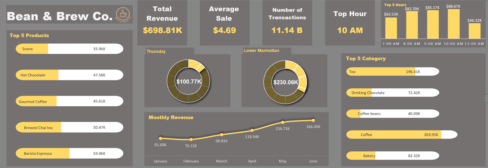

# ☕ Bean & Brew Co. — Excel Sales Dashboard & Data Analysis

This project analyzes real-world coffee shop sales data to uncover trends in product performance, customer purchasing behavior, and store performance. Built using Microsoft Excel, the interactive dashboard includes visual KPIs, pivot tables, and slicers that deliver a clean, professional portfolio-ready report.

---

## 🧠 Key Business Questions
1. What is the total revenue generated per product category?
2. Which product types sell the highest quantity and bring in the most revenue?
3. What is the average sale per transaction?
4. Which store location performs best in terms of sales?
5. How does revenue trend across different months?
6. What are the top 5 best-selling products?
7. Which day of the week drives the most sales volume?
8. What are peak hours for transactions?
9. How do different months compare in sales volume?
10. How can stakeholders quickly interpret KPIs like revenue, transactions, and top product?

---

## 📊 Dashboard Preview

---

## 📊 Tools Used
- **Microsoft Excel**
- **Formulas:** `SUMIFS`, `COUNTIFS`, `AVERAGEIFS`, `IF`
- **Pivot Tables & Pivot Charts**
- **Slicers for interactivity**
- **Data Validation drop-downs**
- **Dynamic KPI Cards**
- **Bar, Line, Donut, and Pie Charts**

---

## 📌 Key Insights
- **Total Revenue** and **Top-Selling Products** are displayed clearly via KPIs and bar charts.
- **Monthly Revenue Trends** show clear seasonality and peak periods.
- **Donut chart** visualizes store performance distribution effectively.
- **Interactive slicers** allow filtering by store, product, and month.
- **Average sale per transaction** sits around ~$4.69, indicating strong upsell potential.
- **Task breakdown** demonstrates ability to clean, analyze, and present structured business data in Excel.

---

## 📂 Dataset Overview
The dataset contains transactional sales data for a fictional chain of coffee shops and includes:
- Product names and categories
- Store locations
- Transaction date and time
- Quantity sold
- Unit price and calculated total sale

> **Source:** [Coffee Sales Dataset | Kaggle](https://www.kaggle.com/datasets/ahmedabbas757/coffee-sales)
