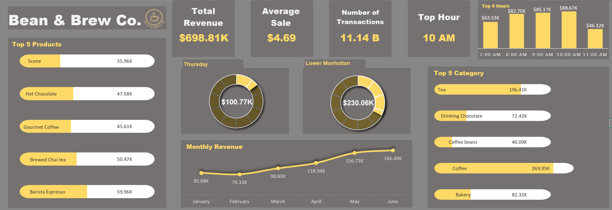

# Bean & Brew Co. — Excel Sales Dashboard & Data Analysis

In this project, I analyzed transactional sales data for a fictional coffee shop chain, Bean & Brew Co., using Microsoft Excel. My objective was to transform raw sales data into an interactive, executive-ready dashboard that highlights revenue trends, product performance, store comparisons, and customer purchasing behavior.

Through structured analysis using formulas, pivot tables, and dynamic visualizations, I developed a clean and professional dashboard designed to help stakeholders quickly interpret key performance indicators and identify opportunities for revenue growth.

---

## Project Objectives
In this analysis, I aimed to answer the following business questions:
1. What is the total revenue generated per product category?
2. Which product types sell the highest quantity and bring in the most revenue?
3. What is the average sale per transaction?
4. Which store location performs best in terms of sales?
5. How does revenue trend across different months?
6. What are the top 5 best-selling products?
7. Which day of the week drives the most sales volume?
8. What are peak hours for transactions?
9. How do different months compare in sales volume?
10. How can stakeholders quickly interpret KPIs like revenue, transactions, and top product?

---

## Dashboard Preview

---

## Tools & Technical Approach
In this project, I used:
- Microsoft Excel
- Formulas such as SUMIFS, COUNTIFS, AVERAGEIFS, and IF for conditional aggregation
- Pivot Tables for summarizing revenue, quantity, and store-level performance
- Pivot Charts to visualize trends dynamically
- Slicers to enable interactive filtering by store, product category, and month
- Data validation drop-downs for structured filtering
- Dynamic KPI cards to display key metrics (total revenue, average transaction value, top product)
- Bar, line, donut, and pie charts for visual storytelling

I structured the workbook to separate raw data, analysis layers, and dashboard presentation to maintain clarity and scalability.

---

## Key Insights / Results
Through this dashboard, I identified:
- Clear revenue concentration among top-selling beverage categories.
- Seasonal revenue trends with noticeable peak months.
- One store location consistently outperforming others in total sales.
- An average transaction value of approximately $4.69, suggesting potential for bundle or upsell strategies.
- Specific days and hours driving higher transaction volumes, informing staffing and promotional timing.
- The top five best-selling products contributing a significant share of total revenue.

This analysis demonstrates how structured Excel modeling can support operational planning, revenue optimization, and data-driven decision-making in a retail environment.

---

## Challenges I Encountered
One challenge I faced was ensuring formula accuracy across large datasets while maintaining performance efficiency. I addressed this by using structured references and minimizing redundant calculations.

Another challenge involved designing a dashboard that balanced interactivity with simplicity. I resolved this by grouping visuals logically and prioritizing key KPIs at the top.

Additionally, validating consistency between pivot table summaries and formula-based KPIs required careful cross-checking.

---

## Dataset Overview
The dataset contains transactional sales data for a fictional coffee shop chain and includes:
- Product names and categories
- Store locations
- Transaction date and time
- Quantity sold
- Unit price and calculated total sale
